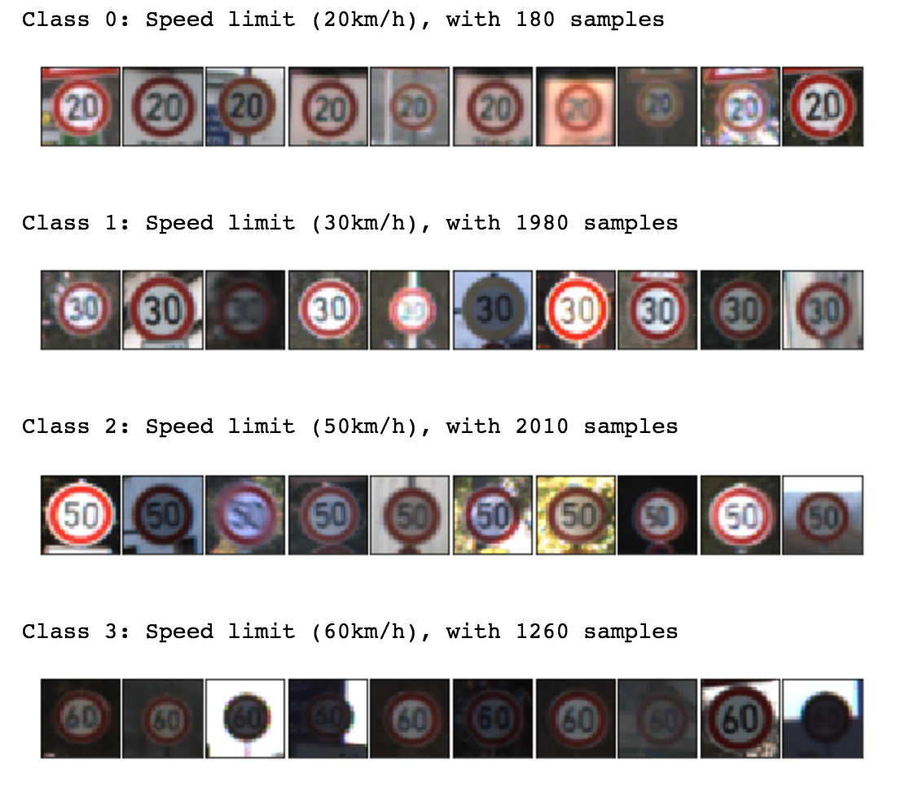
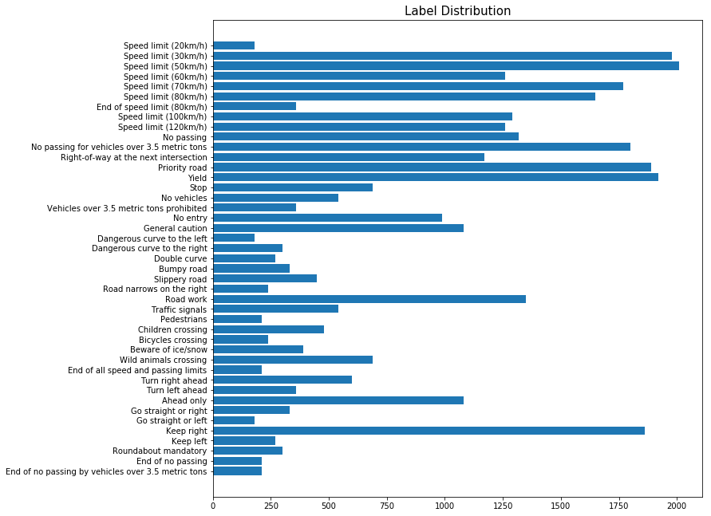
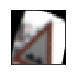
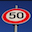
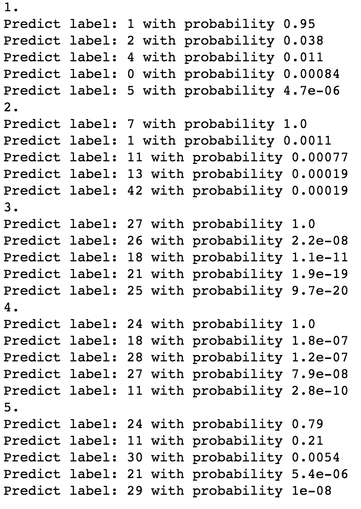

# Traffic Sign Recognition Project Write-up

---
# Traffic Sign Recognition
The goals and steps:
* Load the data set (see below for links to the project data set)
* Explore, summarize and visualize the data set
* Design, train and test a model architecture
* Use the model to make predictions on new images
* Analyze the softmax probabilities of the new images
* Summarize the results with a written report

---

### Data Set Summary & Exploration

#### 1. Provide a basic summary of the data set and identify where in your code the summary was done. In the code, the analysis should be done using python, numpy and/or pandas methods rather than hardcoding results manually.

The code for this step is contained in the second code cell of the Jupyter notebook.  

I used numpy to do the work:

* The size of training set is 34799
* The size of test set is 12630
* The shape of a traffic sign image is 32x32x3
* The number of unique classes/labels in the data set is 43

#### 2. Include an exploratory visualization of the dataset and identify where the code is in your code file.

In cell 6, I displayed 10 random images from each class. Here's an example:

I also created a bar chart in cell 7 showing the sample counts from those labels.

As you can see, the data set is quite unbalanced. So we need to do some augmentation works here.

### Design and Test a Model Architecture

#### 1. Describe how, and identify where in your code, you preprocessed the image data. What tecniques were chosen and why did you choose these techniques? Consider including images showing the output of each preprocessing technique. Pre-processing refers to techniques such as converting to grayscale, normalization, etc.

The preprocessing techniques I used are:
- data augmentation
- Contrast Limited Adaptive Histogram Equalization (CLAHE)

In data augmentation, I used OpenCV's rotation, translation, and shear function. I random select 500 images from those labels which have less than 1000 examples and transform those images to generate 500 new images and added to the training set. The number of training set increases from 34799 to 223799. 

A sample transformed image:

I didn't explicitly normalize the data because `scikit-image`'s histogram equalization does the similar thing.

#### 2. Describe, and identify where in your code, what your final model architecture looks like including model type, layers, layer sizes, connectivity, etc.) Consider including a diagram and/or table describing the final model.

I used the vanilla LeNet with a dropout layer with 0.75 probability added after the first two fully connected layer respectively.

| Layer | Description |
| :-: | :-: |
| Input | 32x32x3 RGB image |
| Conv1 5x5 | 1x1 stride, valid padding, outputs 28x28x6 |
| ReLU |  |
| Max pooling | 2x2 stride, outputs 14x14x6 |
| Conv2 5x5 | 1x1 stride, valid padding, outputs 10x10x16 |
| ReLU |  |
| Max pooling | 2x2 stride, outputs 5x5x16 |
| fc1 | Input = 400, Output = 120 |
| dropout | 0.75 |
| fc2 | Input = 120, Output = 84 |
| dropout | 0.75 |
| fc3 | Input = 84, Output = 43 |
| softmax |  |

#### 3. Describe how, and identify where in your code, you trained your model. The discussion can include the type of optimizer, the batch size, number of epochs and any hyperparameters such as learning rate.

- Optimizer: Adam
- Batch size: 128
- Number of epochs: 80
- Learning rate: 0.001

#### 4. Describe the approach taken for finding a solution. Include in the discussion the results on the training, validation and test sets and where in the code these were calculated. Your approach may have been an iterative process, in which case, outline the steps you took to get to the final solution and why you chose those steps. Perhaps your solution involved an already well known implementation or architecture. In this case, discuss why you think the architecture is suitable for the current problem.

My final model results were:
* validation set accuracy of ~92%
* test set accuracy of ~1.8%

1. The first architecture is the vanilla LeNet with only a few changes to adjust to the data set. The result is around 90% accuracy on validation set and 0.8% on test set.  The problem is overfitting. 
2. In the second architecture, I chose to add dropout layers after the first two fully connected layers. The dropout layers help the model to deliberately randomly lose some neurons to better generalize. The result has improved a little, but not too much.
 

### Test a Model on New Images

#### 1. Choose five German traffic signs found on the web and provide them in the report. For each image, discuss what quality or qualities might be difficult to classify.

Here are five German traffic sign images I found online.

All original images are in high resolution. I transformed them to 32x32 size to fit the model's input size. The quality are very good with clear display of the sign and no shadows or low light conditions. The first image (50 km/h speed limit) may be difficult to classify because it's shot from a low angle. 

#### 2. Discuss the model's predictions on these new traffic signs and compare the results to predicting on the test set. 

Here are the results of the prediction:

| Image | Prediction |
| :-: | :-: |
| 30 km/h | 30 km/h |
| 50 km/h | 100 km/h |
| Pedestrians | Pedestrians  |
| General Caution | Road narrows on the right |
| Right of Way | Road narrows on the right |

The model was able to correctly guess 2 of the 5 traffic signs, which gives an accuracy of 40%. This result is much better than the accuracy on the test set.

#### 3. Describe how certain the model is when predicting on each of the five new images by looking at the softmax probabilities for each prediction and identify where in your code softmax probabilities were outputted. Provide the top 5 softmax probabilities for each image along with the sign type of each probability.

Here're the probabilities.

